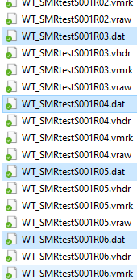
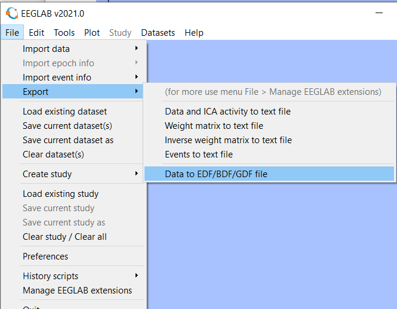

Converting BCI2000 SMR scenario for OpenVibe classification

Since *BCI2000 import box in OpenVibe currently does not work* let\'s see a workaround

## Convert BCI2000 files to BrainVision format

### Solution for experts: the Matlab way

You need for this Matlab and EEGLab installed, and edit the file at [convert_BCI2000_to_OpenVibe.m](matlab_convert/convert_BCI2000_to_OpenVibe.m). It is planned for 4 classes stimulus presentation.

Place your `<filename>.dat` files into `matlab_convert/to_convert` and it should output in `matlab_convert/converted`

### easy solution: proceed manually

Yes, the .vhdr .mrk .eeg format properly save the markers that we need for our analysis.
All you need is the latest version of BCI2000, EEGLab and OpenVibe
Reach the export converter `~\BCI2000 v3.6.R6143\BCI2000.x64\tools\BCI2000Export\BCI2000Export.exe`

Drag and drop the .dat files in the selected area or select    `File>Open`. Make sure to only check the stimuli you want to use afterwards, and prevent EEGLab to be overwhelmed with useless markers.

I now have a lot of converted files

## Open the files in EEGLab

Check on 

[EEGLab download page]: https://sccn.ucsd.edu/eeglab/downloadtoolbox.php

The compiled version v2021.0 failed to export EDF and GDF files, I recommend installing either Matlab or Octave and running EEGLab from there. (note: Octave requires manual installation of the BIOSIG plugin to download on EEGLAB website)

Start by using the BIOSIG loading tool to load the freshly converted .vhdr files

Click **No thanks** to avoid saving the files and yes to the next prompts to automatically load all datasets

Now you will want to check signals and the presence of the markers you previously selected. 
Select one dataset

The signals are clearly visible and You can see one Stimulus marker in Green. It means that both signal and markers were properly converted.

The next step is to concatenate all data files into one. The procedure is to select the first dataset

Then press `Edit>Append Dataset`. Add all the dataset numbers separated by a coma, in my case 2,3,4,5,6,7:

It will output a new dataset named "Merged datasets"

Now that we have all concatenated, lets export it to a GDF file in 

Select GDF

And proceed to exporting.
If you get an error message at this point, I recommend to check for another/newer version of EEGLAB.

## Reading the file using OpenVibe 

Install the latest version of openvibe (current is v3)

### Check your data

Make a minimalistic script to check for signals and markers in the gdf file

Signals AND markers should be visible when starting the scenario (click on the Magnifier/Signal display bar to enable Stimulation colors)

